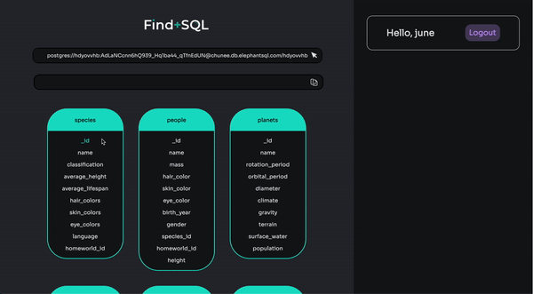
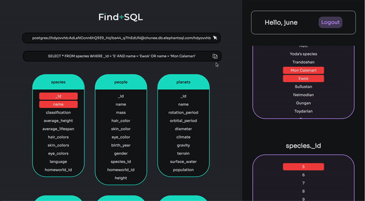

Find+SQL was designed to provide a visual solution to navigating any PostgreSQL database through interactive tables and an automated generation of query strings.

## Table of Contents

* [How to Install](#how-to-install)
* [Usage](#usage)
* [Built With](#built-with)
* [Features](#features)
* [Upcoming Features](#upcoming-features)
* [License](#license)
* [Contributors](#contributors)

## How to Install

## Usage

Input any PostgresQL URI.

Generate a query for all columns from multiple tables.

Generate a Full Outer Join query from two tables with multiple pairs of matching columns.

Generate a query for multiple columns from a single table.

Generate a Where Clause query using AND and OR from a single table with multiple columns and values.

Copy and paste the generated query string.

## Built With

* React.js (React Hooks)
* Node.js
* Express
* Electron
* GraphQL
* PostgresQL
* AWS

## Features

* Authentication
* Dynamic URI Input
* Dynamic visual representation of relational tables
* Interactive tables/columns/values associated
* Dynamic query string generator
* Able to save previous queries

## Upcoming Features

* More query string functionality
* Docker support
* Arrow components to point towards relational data
* Integrate testing

## License

Find+SQL is MIT licensed.

## Contributors

* [Carney Bernard](https://github.com/EBERNARD2)
* [Darren Chan](https://github.com/DarrenChan18)
* [June Culp](https://github.com/juneculp)
* [Anthony Rosales](https://github.com/anthonybarcelorosales)
